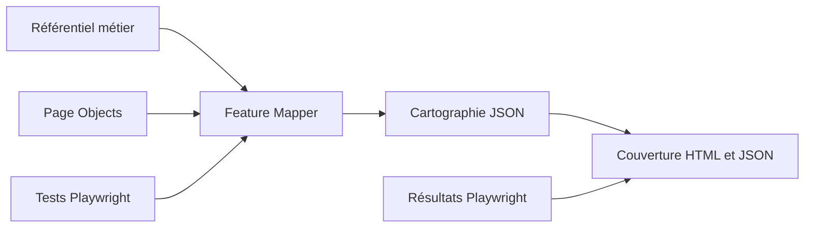

# SauceDemo QA Automation

[](https://github.com/maximejoannis/saucedemo-qa-automation/actions/workflows/playwright.yml)
[](https://github.com/maximejoannis/saucedemo-qa-automation/actions/workflows/deploy-pages.yml)
[](https://playwright.dev/)
[](https://nodejs.org/)
[](https://developer.mozilla.org/fr/docs/Web/JavaScript)
[](https://eslint.org/)
[](https://prettier.io/)
[](https://allurereport.org/)

Framework d'automatisation End-to-End pour [SauceDemo](https://www.saucedemo.com/), construit avec Playwright et enrichi d'un moteur déterministe de cartographie fonctionnelle.

Le projet relie trois niveaux de preuve :

- le référentiel métier : User Stories, critères d'acceptation, fonctionnalités et règles métier ;
- l'implémentation : Page Objects, fixtures, données et scénarios Playwright ;
- les résultats : rapports Playwright, Allure, qualité du code et couverture fonctionnelle.

> **Contexte public et pédagogique**  
> Ce dépôt d'automatisation est destiné au partage et à l'apprentissage autour d'une application publique de démonstration. Il ne manipule aucune donnée personnelle, confidentielle ou issue d'un environnement de production.

## Sommaire

- [Vue d'ensemble](#vue-densemble)
- [Résultats clés](#résultats-clés)
- [Périmètre fonctionnel](#périmètre-fonctionnel)
- [Architecture](#architecture)
- [Prérequis](#prérequis)
- [Installation](#installation)
- [Exécuter les tests](#exécuter-les-tests)
- [Qualité du code](#qualité-du-code)
- [Rapports](#rapports)
- [AI Feature Mapper](#ai-feature-mapper)
- [Intégration continue](#intégration-continue)
- [Ajouter un scénario](#ajouter-un-scénario)
- [Conventions](#conventions)
- [Limites connues](#limites-connues)
- [Roadmap](#roadmap)
- [Contribution](#contribution)
- [Licence](#licence)

## Vue d'ensemble

Le dépôt automatise les principaux parcours e-commerce de SauceDemo :

- authentification et refus de connexion ;
- consultation et tri du catalogue ;
- consultation d'une fiche produit ;
- ajout, consultation et suppression d'articles dans le panier ;
- saisie des informations client ;
- contrôle du récapitulatif et des montants ;
- validation et confirmation d'une commande ;
- parcours d'achat complets avec un ou plusieurs produits.

L'architecture suit le modèle **Page Object Model**. L'état authentifié commun est préparé une fois par le `globalSetup`, puis réutilisé par les suites qui en ont besoin.

Le moteur **AI Feature Mapper** — malgré son nom historique — n'appelle actuellement aucun modèle de langage. Son analyse est locale, déterministe et reproductible.

## Résultats clés

Les chiffres suivants ont été vérifiés dans la version actuelle du dépôt :

| Indicateur                        | Valeur | Signification                                                        |
| --------------------------------- | -----: | -------------------------------------------------------------------- |
| User Stories                      |      5 | Parcours décrits dans [`docs/user-stories.md`](docs/user-stories.md) |
| Critères d'acceptation            |     16 | Critères recensés dans les 5 User Stories                            |
| Fonctionnalités                   |     14 | Fonctionnalités Fxx du référentiel                                   |
| Règles métier                     |     12 | Règles BRxx documentées                                              |
| Scénarios Playwright              |     43 | Tests distincts dans 5 fichiers `.spec.js`                           |
| Navigateurs                       |      2 | Chromium et Firefox                                                  |
| Exécutions configurées            |     86 | 43 scénarios × 2 navigateurs                                         |
| Tests unitaires du Feature Mapper |     26 | Tests Node.js du moteur d'analyse                                    |
| Page Objects                      |      4 | Login, catalogue, panier et checkout                                 |

### Indicateurs de couverture

| Mesure                                   |    Résultat actuel | Périmètre mesuré                                                    |
| ---------------------------------------- | -----------------: | ------------------------------------------------------------------- |
| Couverture des fonctionnalités déclarées |  **14/14 — 100 %** | Au moins un test associé à chaque fonctionnalité du référentiel     |
| Couverture stricte des règles métier     | **10/12 — 83,3 %** | Règles démontrées par un scénario et une assertion explicites       |
| Critères d'acceptation avec une preuve   |  **16/16 — 100 %** | Au moins un test pertinent pour chaque critère                      |
| Critères avec un cas passant             | **14/16 — 87,5 %** | Parcours nominal ou résultat valide                                 |
| Critères avec un cas non passant         |  **3/16 — 18,8 %** | Refus métier ou validation attendue                                 |
| Critères avec un cas d'erreur technique  |     **0/16 — 0 %** | Défaillance technique ou comportement dégradé explicitement vérifié |

Ces pourcentages répondent à des questions différentes. Ils ne doivent ni être additionnés ni être interprétés comme une mesure unique de qualité.

Le dernier fichier d'exécution conservé dans le dépôt indique **86 exécutions réussies sur 86**, sans échec, test ignoré ou test instable. Ce résultat est un instantané daté du **2 août 2026** ; le statut courant reste celui du dernier workflow GitHub Actions exécuté.

## Périmètre fonctionnel

| User Story | Domaine          | Fonctionnalités principales                                      | Scénarios |
| ---------- | ---------------- | ---------------------------------------------------------------- | --------: |
| US01       | Authentification | Connexion valide, utilisateur bloqué, identifiants invalides     |         9 |
| US02       | Catalogue        | Liste des produits, détail produit, quatre tris                  |         9 |
| US03       | Panier           | Panier vide, ajouts, retraits, persistance et navigation         |        10 |
| US04       | Checkout         | Champs obligatoires, corrections, formats acceptés et annulation |         9 |
| US05       | Parcours E2E     | Récapitulatif, montants, annulation, achat et confirmation       |         6 |
| **Total**  |                  |                                                                  |    **43** |

Le référentiel complet se trouve dans :

- [`docs/user-stories.md`](docs/user-stories.md) ;
- [`docs/functional-map.md`](docs/functional-map.md) ;
- [`docs/business-rules.md`](docs/business-rules.md) ;
- [`docs/glossary.md`](docs/glossary.md).

## Architecture

```text
.
├── .github/workflows/
│   ├── playwright.yml              # Qualité, tests E2E, artefacts et publication
│   └── deploy-pages.yml            # Validation et publication des rapports QA statiques
├── ai/feature-mapper/
│   ├── execution/                  # Exécution Playwright avec preuve JSON
│   ├── explorers/                  # Exploration et graphe de navigation
│   ├── output/                     # Cartographie et rapports générés
│   ├── parsers/                    # Analyse du référentiel, des POM et des tests
│   ├── reasoning/                  # Corrélation et calcul de couverture
│   ├── report/                     # Génération du rapport HTML/JSON
│   ├── reporters/                  # Sérialisation des résultats
│   ├── tests/                      # Tests unitaires du moteur
│   ├── tools/                      # Accès au dépôt, aux tests et au navigateur
│   ├── validators/                 # Validation des entrées et résultats
│   ├── agent.js                    # Orchestration principale
│   └── config.js                   # Configuration
├── docs/
│   ├── architecture/               # Documentation du Feature Mapper
│   ├── business-rules.md            # 12 règles métier BRxx
│   ├── functional-map.md            # 14 fonctionnalités Fxx
│   ├── glossary.md
│   └── user-stories.md              # 5 User Stories et 16 critères
├── reports/
│   ├── acceptance/                 # Rapport critères d'acceptation
│   ├── coverage/                   # Rapport couverture fonctionnelle
│   └── index.html                  # Portail des rapports QA
├── scripts/
│   └── generate-quality-report.js  # Rapport qualité ESLint/Prettier
├── src/
│   ├── data/                       # Utilisateurs, produits et client checkout
│   ├── fixtures/                   # Fixtures Playwright personnalisées
│   └── pages/                      # Page Objects
├── tests/
│   ├── us01-authentication/
│   ├── us02-catalogue/
│   ├── us03-panier/
│   ├── us04-checkout/
│   └── us05-e2e/
├── eslint.config.js
├── global-setup.js
├── playwright.config.js
└── package.json
```

### Flux principal



## Prérequis

- Node.js en version LTS ;
- npm ;
- Git ;
- un accès réseau à [SauceDemo](https://www.saucedemo.com/) ;
- les dépendances système Playwright sur Linux.

Le workflow CI utilise la version Node.js LTS disponible au moment de son exécution.

## Installation

Clonez le dépôt puis installez les dépendances verrouillées :

```bash
git clone https://github.com/maximejoannis/saucedemo-qa-automation.git
cd saucedemo-qa-automation
npm ci
```

Installez Chromium et Firefox :

```bash
npx playwright install chromium firefox
```

Sous Linux, dans un conteneur ou dans GitHub Codespaces :

```bash
npx playwright install --with-deps chromium firefox
```

Le projet n'exige pas de fichier `.env`. Les utilisateurs de démonstration et les données fonctionnelles sont définis dans `src/data/`.

## Exécuter les tests

### Suite complète

```bash
npm test
```

Cette commande exécute les 43 scénarios sur Chromium et Firefox, soit 86 exécutions configurées.

### Observer le navigateur

```bash
npm run test:headed
```

### Utiliser l'interface Playwright

```bash
npm run test:ui
```

### Cibler un navigateur

```bash
npx playwright test --project=chromium
npx playwright test --project=firefox
```

### Cibler une User Story ou un fichier

```bash
npx playwright test tests/us01-authentication
npx playwright test tests/us03-panier/ac01-panier.spec.js
```

### Exécuter les tests tagués

```bash
npx playwright test --grep "@smoke"
npx playwright test --grep "@critical"
```

### Déboguer

```bash
npx playwright test --debug
```

### Lister les tests sans les exécuter

```bash
npx playwright test --list
```

### Comportement CI

Dans GitHub Actions, la configuration applique :

- un seul worker ;
- deux tentatives supplémentaires en cas d'échec ;
- `forbidOnly` pour empêcher un `test.only` oublié ;
- une trace au premier retry ;
- une capture et une vidéo conservées en cas d'échec.

## Qualité du code

| Commande                 | Rôle                                             |
| ------------------------ | ------------------------------------------------ |
| `npm run lint`           | Analyse tous les fichiers JavaScript avec ESLint |
| `npm run lint:fix`       | Applique les corrections ESLint disponibles      |
| `npm run format`         | Formate le dépôt avec Prettier                   |
| `npm run format:check`   | Vérifie le formatage sans modifier les fichiers  |
| `npm run quality`        | Exécute ESLint puis la vérification Prettier     |
| `npm run quality:report` | Génère le rapport qualité dans `quality-report/` |

Vérification locale recommandée avant un push :

```bash
npm run quality
npm run test:ai
npx playwright test --list
```

Dans la version analysée, `npm run quality` et les **26 tests unitaires** du Feature Mapper réussissent.

## Rapports

### Rapports Playwright et Allure

| Rapport          | Génération                | Emplacement local    |
| ---------------- | ------------------------- | -------------------- |
| Playwright HTML  | `npm test`                | `playwright-report/` |
| Résultats Allure | `npm test`                | `allure-results/`    |
| Allure HTML      | `npm run allure:generate` | `allure-report/`     |
| Qualité du code  | `npm run quality:report`  | `quality-report/`    |

Ouvrir le rapport Playwright :

```bash
npx playwright show-report
```

Générer puis ouvrir Allure :

```bash
npm run allure:generate
npm run allure:open
```

### Rapports de couverture

Deux rapports statiques et interactifs sont versionnés dans `reports/` :

- [`reports/coverage/`](reports/coverage/) : fonctionnalités, règles métier et écarts ;
- [`reports/acceptance/`](reports/acceptance/) : User Stories, critères et types de cas ;
- [`reports/index.html`](reports/index.html) : portail d'accès aux deux rapports.

Ils peuvent être consultés localement avec un serveur statique :

```bash
npx serve reports
```

Ou, sans dépendance supplémentaire :

```bash
python3 -m http.server 8000 --directory reports
```

Puis ouvrez `http://localhost:8000`.

Le workflow `deploy-pages.yml` publie le dossier `reports/` vers GitHub Pages après validation de la présence des trois pages principales et de la syntaxe JavaScript.

Portail attendu : [maximejoannis.github.io/saucedemo-qa-automation](https://maximejoannis.github.io/saucedemo-qa-automation/)

> Consultez la section [Limites connues](#limites-connues) avant de modifier les workflows de publication.

## AI Feature Mapper

Le Feature Mapper transforme les sources du dépôt en une cartographie fonctionnelle exploitable.

### Sources analysées

- `docs/functional-map.md` ;
- Page Objects de `src/pages/` ;
- scénarios de `tests/` ;
- résultats Playwright JSON lorsqu'ils sont disponibles.

### Commandes

| Commande                     | Résultat                                                               |
| ---------------------------- | ---------------------------------------------------------------------- |
| `npm run ai:map-features`    | Analyse le dépôt et génère `feature-map.json`                          |
| `npm run test:ai`            | Exécute les 26 tests unitaires du moteur                               |
| `npm run ai:coverage-report` | Produit le rapport de couverture à partir de la cartographie existante |
| `npm run ai:report`          | Régénère la cartographie puis les rapports HTML/JSON                   |
| `npm run test:coverage`      | Exécute Playwright avec le reporter JSON de preuve                     |
| `npm run ai:report:executed` | Régénère un rapport enrichi par la dernière exécution Playwright       |

### Livrables générés

```text
ai/feature-mapper/output/
├── feature-map.json
├── coverage-report.json
├── coverage-report.html
└── playwright-results.json
```

### Formule principale

```text
couverture fonctionnelle = fonctionnalités couvertes / fonctionnalités recensées × 100
```

Une fonctionnalité est considérée couverte lorsque le moteur trouve une corrélation entre le référentiel, les Page Objects et les tests. Si le rapport Playwright JSON existe, le résultat est enrichi avec le statut de la dernière exécution.

Cette mesure reste une corrélation statique : elle ne prouve pas encore quelle assertion exacte valide chaque fonctionnalité.

## Intégration continue

### `playwright.yml`

Déclenché sur les push et pull requests visant `main`, ainsi que manuellement. Il :

1. installe les dépendances ;
2. exécute ESLint et Prettier ;
3. génère le rapport qualité ;
4. installe les navigateurs Playwright ;
5. exécute la suite E2E ;
6. génère Allure ;
7. charge les rapports comme artefacts GitHub Actions pendant 30 jours ;
8. prépare et publie Allure et le rapport qualité sur GitHub Pages hors pull request ;
9. fait échouer le job à la fin si ESLint ou Prettier a échoué.

### `deploy-pages.yml`

Déclenché lorsqu'un fichier de `reports/**` change sur `main`, ou manuellement. Il :

1. vérifie les trois fichiers `index.html` requis ;
2. valide la syntaxe des fichiers JavaScript ;
3. publie le dossier `reports/` sur GitHub Pages.

### Artefacts CI

| Artefact              | Rétention |
| --------------------- | --------: |
| `playwright-report`   |  30 jours |
| `allure-results`      |  30 jours |
| `allure-report`       |  30 jours |
| `code-quality-report` |  30 jours |

## Ajouter un scénario

1. Identifiez la User Story et le critère d'acceptation dans `docs/`.
2. Ajoutez ou complétez les données dans `src/data/`.
3. Ajoutez les interactions réutilisables dans le Page Object concerné.
4. Créez le scénario dans le dossier `tests/usxx-*` correspondant.
5. Utilisez les fixtures exposées par `src/fixtures/test.js`.
6. Ajoutez des assertions qui démontrent directement le résultat métier attendu.
7. Exécutez le test sur Chromium et Firefox.
8. Lancez les contrôles qualité et les tests du Feature Mapper.
9. Régénérez la cartographie et les rapports si le référentiel change.

Exemple de squelette :

```js
const { test, expect } = require('../../src/fixtures/test');

test.describe('USxx - Domaine', () => {
  test('TC-USxx-ACxx-01 résultat attendu', async ({ page }) => {
    // Arrange / Given
    // Act / When
    // Assert / Then
    await expect(page).toHaveURL(/expected/);
  });
});
```

## Conventions

### Nommage

- suites métier : `USxx - Domaine` ;
- scénarios : `TC-USxx-ACxx-nn description` ;
- fonctionnalités : `Fxx` ;
- règles métier : `BRxx` ;
- Page Objects : classe et fichier en `PascalCase` ;
- méthodes et variables : `camelCase`.

### Bonnes pratiques

- privilégier les locators `data-test` et les rôles accessibles ;
- placer les sélecteurs et actions réutilisables dans les Page Objects ;
- séparer les données de test des scénarios ;
- éviter les délais fixes ;
- conserver des tests indépendants ;
- utiliser une assertion métier explicite, pas seulement une vérification d'URL ;
- ne jamais versionner de secret ou de données réelles.

## Limites connues

### Corrélation fonctionnelle

Le moteur peut produire des associations trop larges lorsque plusieurs tests partagent une fixture ou un Page Object. Le taux de 100 % des fonctionnalités déclarées doit donc être lu avec les preuves détaillées et la revue QA.

### Profondeur des tests

- BR04 — accès aux pages protégées sans authentification — n'est pas démontrée ;
- BR09 — checkout interdit avec panier vide — n'est pas démontrée ;
- seuls 3 critères sur 16 possèdent un cas non passant identifié ;
- aucun critère ne possède encore un véritable cas d'erreur technique ;
- `error_user`, `visual_user`, `Reset App State` et l'ajout depuis la fiche produit restent à approfondir.

### Publication GitHub Pages

Les workflows `playwright.yml` et `deploy-pages.yml` publient actuellement deux artefacts différents vers le même environnement `github-pages` :

- `playwright.yml` publie Allure à la racine et la qualité sous `/quality/` ;
- `deploy-pages.yml` publie le portail statique `reports/`.

GitHub Pages ne conserve qu'un déploiement actif à la fois. Le dernier workflow terminé peut donc remplacer le contenu publié par l'autre. La publication doit être consolidée dans un seul artefact et un seul job de déploiement pour exposer durablement Allure, qualité, couverture et acceptance sous une même racine.

### Documentation d'architecture

Les documents `ai/feature-mapper/README.md` et `docs/architecture/ai-feature-mapper.md` ne décrivent pas exactement le même périmètre : le premier attribue le calcul de couverture au Feature Mapper, tandis que le second le réserve à un composant Coverage Analyzer. Cette responsabilité reste à harmoniser.

## Roadmap

### Priorité P0

- couvrir BR04 : accès direct sans authentification ;
- couvrir BR09 : checkout avec panier vide ;
- consolider les deux publications GitHub Pages.

### Priorité P1

- ajouter des cas non passants pour le catalogue, le panier et la commande ;
- introduire des cas d'erreur technique contrôlés ;
- couvrir `error_user` et `visual_user` ;
- tester les états incohérents et les données limites ;
- ajouter les identifiants Fxx, BRxx et USxx-ACxx dans les métadonnées des tests ;
- renforcer le moteur de corrélation avec les assertions réellement exécutées.

### Priorité P2

- couvrir `Reset App State` ;
- tester l'ajout et le retrait depuis la fiche produit ;
- harmoniser la documentation d'architecture ;
- automatiser la régénération des deux rapports statiques dans la CI.

## Contribution

Les contributions sont bienvenues pour enrichir les scénarios, les preuves de couverture et le moteur d'analyse.

Avant de proposer une modification :

```bash
npm ci
npm run quality
npm run test:ai
npm test
```

Une pull request devrait :

- expliquer le besoin ou le risque couvert ;
- référencer la User Story, le critère et la règle métier concernés ;
- inclure des assertions explicites ;
- rester indépendante des autres tests ;
- réussir sur Chromium et Firefox ;
- mettre à jour le référentiel et les rapports si nécessaire.

## Licence

Aucun fichier de licence n'est présent dans la version analysée du dépôt. Pour rendre le statut open source juridiquement explicite, ajoutez une licence adaptée — par exemple MIT, Apache-2.0 ou une autre licence choisie par le propriétaire du projet.

L'application SauceDemo, ses marques et ses contenus restent soumis aux conditions de leurs propriétaires respectifs.

## Ressources

- [Application SauceDemo](https://www.saucedemo.com/)
- [Documentation Playwright](https://playwright.dev/docs/intro)
- [Documentation Allure](https://allurereport.org/docs/)
- [Documentation GitHub Pages](https://docs.github.com/pages)
- [Documentation du Feature Mapper](ai/feature-mapper/README.md)
