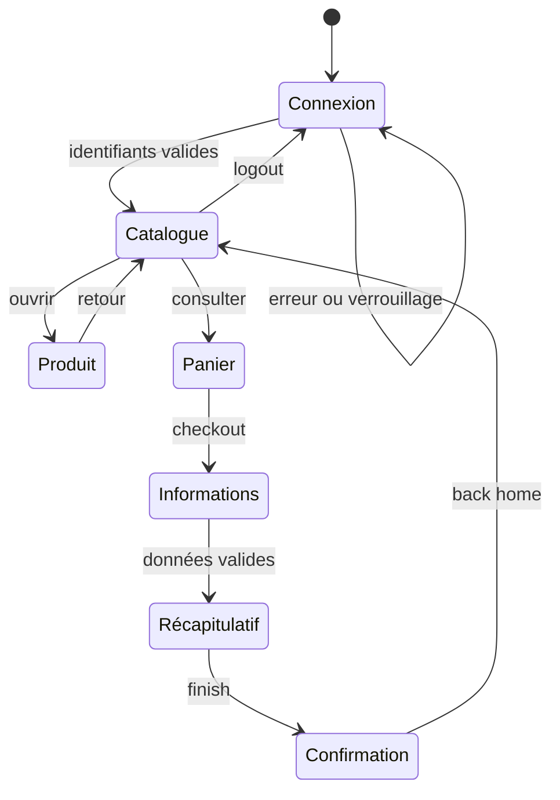

# Cartographie fonctionnelle

## Parcours majeurs

| ID | Domaine | Fonctionnalité | Acteur | Préconditions | Entrées/actions | Résultat attendu | Dépendances | Risque |
|---|---|---|---|---|---|---|---|---|
| F-01 | Authentification | Connexion valide | Visiteur | Compte actif | Identifiant + mot de passe | Catalogue affiché | Service d'identité simulé | Critique |
| F-02 | Authentification | Refus connexion invalide | Visiteur | Aucune | Champs vides/incorrects | Reste sur login, message explicite | Validations | Critique |
| F-03 | Authentification | Compte verrouillé | Visiteur | Compte verrouillé | Identifiants valides | Accès refusé, message dédié | Statut utilisateur | Élevé |
| F-04 | Catalogue | Lister les produits | Client | Authentifié | Ouvrir catalogue | 6 produits, nom, image, description, prix, action | Données catalogue | Critique |
| F-05 | Catalogue | Trier | Client | Catalogue chargé | A-Z, Z-A, prix asc/desc | Ordre conforme, contenu inchangé | Prix/noms | Moyen |
| F-06 | Produit | Consulter une fiche | Client | Produit disponible | Cliquer nom/image | Même nom, description, prix et action | Catalogue | Élevé |
| F-07 | Produit | Retour catalogue | Client | Fiche ouverte | Back to products | Catalogue restauré | Navigation | Moyen |
| F-08 | Panier | Ajouter un produit | Client | Authentifié | Add to cart | Bouton Remove, badge incrémenté | État panier | Critique |
| F-09 | Panier | Retirer un produit | Client | Produit au panier | Remove | Ligne supprimée, badge décrémenté | État panier | Critique |
| F-10 | Panier | Consulter/continuer | Client | Authentifié | Icône panier / Continue Shopping | Contenu exact / retour catalogue | Navigation | Élevé |
| F-11 | Checkout | Saisir les coordonnées | Acheteur | Panier non vide | Prénom, nom, code postal | Accès au récapitulatif | Validations | Critique |
| F-12 | Checkout | Valider champs requis | Acheteur | Étape informations | Omettre un champ | Message associé, pas de progression | Validations | Critique |
| F-13 | Checkout | Vérifier le récapitulatif | Acheteur | Coordonnées valides | Continue | Articles, paiement, livraison, sous-total, taxe, total | Calculs | Critique |
| F-14 | Checkout | Finaliser | Acheteur | Récapitulatif affiché | Finish | Confirmation et retour accueil | État commande | Critique |
| F-15 | Navigation | Annuler checkout | Acheteur | Checkout engagé | Cancel | Retour panier ou catalogue selon étape | Navigation | Élevé |
| F-16 | Session | Menu / déconnexion | Client | Authentifié | Menu, Logout | Retour login, pages privées inaccessibles | Session | Critique |
| F-17 | Session | Réinitialiser l'état | Client | État panier modifié | Reset App State | Panier remis à zéro | Stockage local | Élevé |
| F-18 | Navigation | Accès direct/historique | Client | Variable | URL, retour, refresh | Pas de contournement; état cohérent | Routeur/session | Élevé |

## États et transitions

## Données observées

Six produits sont affichés : Backpack (29,99 $), Bike Light (9,99 $), Bolt T-Shirt (15,99 $), Fleece Jacket (49,99 $), Onesie (7,99 $), T-Shirt Red (15,99 $). Pour un Backpack, le récapitulatif observé affiche sous-total 29,99 $, taxe 2,40 $ et total 32,39 $.

